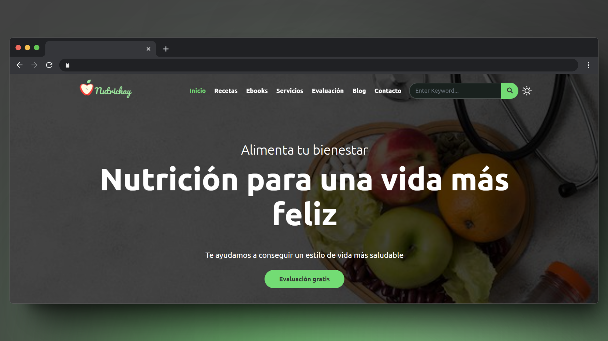

# Nutrichay proyect

## Technologies used:

## Deploy with

## Live DEMO Static Page
[Nutrichay](https://nutrichay.netlify.app/)
## Live DEMO API
[Nutrichay-API](https://api-nutrichay.netlify.app/.netlify/functions/api/v1/)
